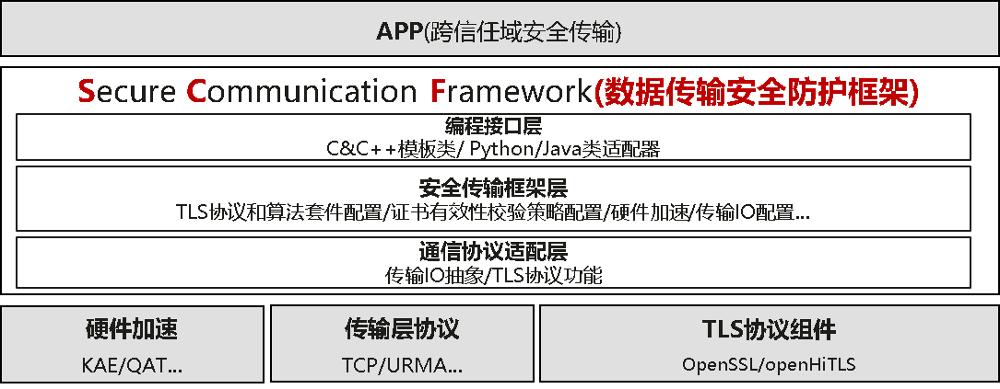

# scf-security

#### 介绍
SCF的全称是Secure Communication Framework，提供安全通信框架SDK库，提供TLS协议和算法套、证书有效性校验、硬件加速、传输IO等配置模板，提升TLS安全通信应用的安全性，供开发者参考。

#### 软件架构


#### 编译安装

1. 编译环境要求

- 编译环境 OpenEuler 内核版本不低于 6.6
- TLS组件 Openssl 1.1.1，3.0.9，3.0.12
- 同时你需要安装以下依赖

```shell
sudo yum install -y rpm-build
sudo yum install -y make
sudo yum install -y cmake
sudo yum install -y gcc
sudo yum install -y gcc-c++
sudo yum install -y libboundscheck
sudo yum install -y rapidjson-devel
sudo yum install -y libasan
```

2. 编译指导

- 直接通过预置脚本进行编译

```shell
sudo sh build.sh rpm 
```

3. 安装指导

- 使用编译生成的rpm包进行安装

```shell
sudo rpm -ivh --nodeps package/rpm/*/scf-security-*.rpm 
```

#### 相关文档

- [接口文档](docs/cn/api_documentation.md)
- [代码样例](sample/sample.md)

#### 许可证信息

本项目遵循 Mulan PSL v2 许可证协议，详情请见 [LICENSE](LICENSE) 文件。

#### 参与贡献

1.  Fork 本仓库
2.  新建 Feat_xxx 分支
3.  提交代码
4.  新建 Pull Request


#### 特技

1.  使用 Readme\_XXX.md 来支持不同的语言，例如 Readme\_en.md, Readme\_zh.md
2.  Gitee 官方博客 [blog.gitee.com](https://blog.gitee.com)
3.  你可以 [https://gitee.com/explore](https://gitee.com/explore) 这个地址来了解 Gitee 上的优秀开源项目
4.  [GVP](https://gitee.com/gvp) 全称是 Gitee 最有价值开源项目，是综合评定出的优秀开源项目
5.  Gitee 官方提供的使用手册 [https://gitee.com/help](https://gitee.com/help)
6.  Gitee 封面人物是一档用来展示 Gitee 会员风采的栏目 [https://gitee.com/gitee-stars/](https://gitee.com/gitee-stars/)
